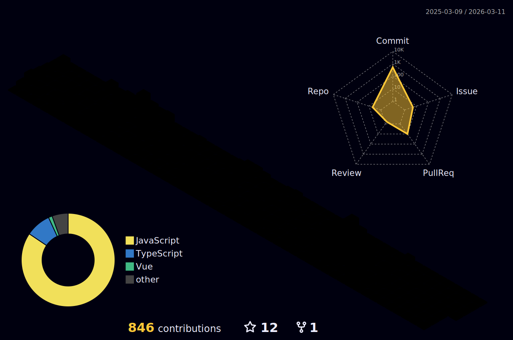

<!-- INTRO -->
<h1 align="center">
  
</h1>

<!-- SUB INTRO -->
<h3 align="center">A passionate Full-Stack Developer from Japan living in Canada🍁</h3>

  

- 🎓 **Latest Computer Science Graduate** from Thompson Rivers University in BC, Canada
- 💼 Actively looking for **Full-Time** or **Intern Tech Roles**
- 🌱 Continuous learner with modern frameworks and libraries, especially **React.js**
- 🆙 Eager to improve my **Full-Stack Skills** to work at [Driveline Baseball](https://www.drivelinebaseball.com/) in the future (**my future goal!**)
- 💬 Ask me about **Full-Stack** | **Android App Development**, and **Software** | **Database** | **Network Engineering**
- 📫 Reach me out via [r.homma.inbox@gmail.com](mailto:r.homma.inbox@gmail.com)
- 🌐 Check out my **[Portfolio](https://ryoichihomma.me/)**

### 🔗 Connect with me
<code></code>
<code></code>
<code></code>
<code></code>

<!--

-->

<!-- TECK STACK -->
## 🖥️ Tech Stack
### 🖱️ Programming & Markup Languages

### 📚 Frameworks & Libraries

#### ☁️ Database & Cloud Hosting

#### 🖽 Design Tools

#### ⚙️ Others

<!--
#### Frontend / Backend / Database

#### Deployment Platforms / OS

#### Network Design / Diagramming / AI Tools

  
  
  
  
  
  
  
  
  
  
  
  

-->
  
<!-- 

  <h4>Frontend / Backend / Database</h4>
  
  
  
  
  
  
  
  
  
  
  
  
  
  

  <h4>Deployment Platforms / OS</h4>
  
  
  
  
  
  
  

  <h4>Network Design / Diagramming / AI Tools</h4>
  
  
  
  
  
  
  
  
  
  
  
  

-->

<!-- YOUTUBE -->
## ▶️ Demo Videos & Prezi  
<!-- BEGIN YOUTUBE-CARDS -->
[")](https://www.youtube.com/watch?v=VT6eddrVVOA#gh-dark-mode-only)[")](https://www.youtube.com/watch?v=VT6eddrVVOA#gh-light-mode-only)
[")](https://www.youtube.com/watch?v=N_yUfrnbgWI#gh-dark-mode-only)[")](https://www.youtube.com/watch?v=N_yUfrnbgWI#gh-light-mode-only)
[")](https://www.youtube.com/watch?v=ayVUSVRPLqE#gh-dark-mode-only)[")](https://www.youtube.com/watch?v=ayVUSVRPLqE#gh-light-mode-only)
<!-- END YOUTUBE-CARDS -->

<!-- CONTRIBUTIONS -->
## 🐍 Contributions
<picture>
  <source media="(prefers-color-scheme: dark)" srcset="https://raw.githubusercontent.com/Ryo-samurai6340/Ryo-samurai6340/output/github-contribution-grid-snake-dark.svg">
  <source media="(prefers-color-scheme: light)" srcset="https://raw.githubusercontent.com/Ryo-samurai6340/Ryo-samurai6340/output/github-contribution-grid-snake.gif">
  
</picture>

<!-- STATS -->
## 📊 GitHub Stats
### 🔥 Streak Stats

### 💻 Profile Stats

<a href="https://github.com/anuraghazra/github-readme-stats">
<!--    -->
  
</a>
<!--

 
<b>Note:</b> Top languages are only a metric of the languages used in my public repositories and don't reflect my private and forked repositories.
-->

### 📈 Activity Graphs

<a href="https://github.com/vn7n24fzkq/github-profile-summary-cards">
  
<!--    -->
</a>

### 🧊 3D Stats

<b>Note:</b> Languages in 3D Stats are only a metric of the languages used in my public repositories and don't reflect my private and forked repositories.
