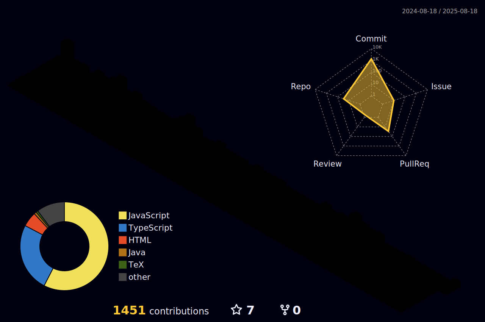

<!-- INTRO -->

<!-- SUB INTRO -->
<h3 align="center">Full-stack software developer/engineer specializing in the MERN stack with an LLM evaluator background</h3>
<!-- <h3 align="center">A passionate Full-Stack Software Developer/Engineer from Japan living in Canada🍁</h3> -->

 

- 🎓 A most recent Computer Science Graduate from Thompson Rivers University in BC, Canada🍁
- 💼 Actively looking for **Software Developer/Engineer roles** in full-time ⚠️ _**AVAILABLE IMMEDIATELY!**_ ⚠️
- 🌱 Continuously learning modern technologies every day, especially **MERN stack**
- 🆙 Eager to improve my **full-stack development skills** to work at [Driveline Baseball Enterprises, Inc](https://www.drivelinebaseball.com/) in the future
- 💬 Ask me about **software development/engineering** and **network design**
- 🌐 Check out my [Portfolio](https://ryoichihomma.me/)

### 🔗 Connect with me

<code></code>
<code></code>
<code></code>
<code></code>
<code></code>
<code></code>

<!--

-->

<!-- TECK STACK -->

## 🖥️ Tech Stack

### 💻 Programming & Markup Languages

### 📚 Frameworks & Libraries

### ☁️ Databases & Cloud Hosting

### 📐 Design & Diagramming Tools

### ⚙️ Other Software & Tools

<!-- PROJECT -->

## 🏛️ Project Gallery  

<!-- BEGIN YOUTUBE-CARDS -->

[")](https://www.youtube.com/watch?v=VT6eddrVVOA#gh-dark-mode-only)[")](https://www.youtube.com/watch?v=VT6eddrVVOA#gh-light-mode-only)
[")](https://www.youtube.com/watch?v=N_yUfrnbgWI#gh-dark-mode-only)[")](https://www.youtube.com/watch?v=N_yUfrnbgWI#gh-light-mode-only)
[")](https://www.youtube.com/watch?v=ayVUSVRPLqE#gh-dark-mode-only)[")](https://www.youtube.com/watch?v=ayVUSVRPLqE#gh-light-mode-only)

<!-- END YOUTUBE-CARDS -->

<!-- CONTRIBUTIONS -->

## 🐍 Contributions

<picture>
  <source media="(prefers-color-scheme: dark)" srcset="https://raw.githubusercontent.com/Ryo-samuraiJP/Ryo-samuraiJP/output/github-contribution-grid-snake-dark.svg">
  <source media="(prefers-color-scheme: light)" srcset="https://raw.githubusercontent.com/Ryo-samuraiJP/Ryo-samuraiJP/output/github-contribution-grid-snake.gif">
  
</picture>

<!-- STATS -->

## 📊 GitHub Stats

### 🔥 Streak Stats

### 📈 Profile Stats

### 🧊 3D Stats

<b>Note:</b> 3D Stats languages are only metric of the languages based on thier commit volume.
